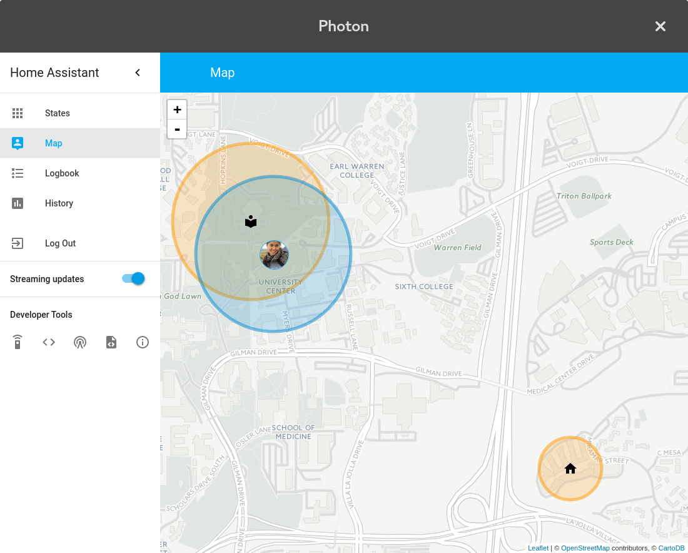

# photon

           _           _
     _ __ | |__   ___ | |_ ___  _ __
    | '_ \| '_ \ / _ \| __/ _ \| '_ \
    | |_) | | | | (_) | || (_) | | | |
    | .__/|_| |_|\___/ \__\___/|_| |_|
    |_|                Lightweight webUI Framework

Build powerful crossplatform Web Apps.
This project is a simple alternative to [Electron](http://electron.atom.io/).

Photon creates a Qt based minimal webView and displays the supplied URL.
This project is work in progress and more features will be added soon.

## Usage

Try it out on the commandline,
simply start your backend an then pass the URL:

```shell
$ ./photon -url http://localhost:8080
...
```

## Options

several commandline options are available:

```
usage: ./photon [-fullscreen] [-disableHighDPI] -url <URL>
    -f | -fullscreen   start in fullscreen mode
    -u | -url          supply URL
    -h | -help         print this help
    -t | -title        set window title
    -disableHighDPI    disable high DPI scaling
```



## Installation

The Qt libraries are required.

Make sure to pick the latest version.
At the time of this writing, the latest version is qt@5.7

### macOS

The Qt Libs can be installed with [brew](http://brew.sh)

```shell
# search latest version
$ brew search qt
... qt@5.7

# install
$ brew install qt@5.7

# link
$ brew link --force qt
```

## Building

```shell
$ make all
```

## Example

Of course you can use your favourite language to spawn your backend and then call photon to display it.

Here's a minimal example how to do it with golang:

```go
// start your backend
err := exec.Command("backend", "-port 8080").Start()
if err != nil {
    log.Fatal(err)
}

// give your backend a little time to start up
time.Sleep(1 * time.Second)

// launch photon
err = exec.Command("photon", "-fullscreen", "-title", "MyApp", "-url", "http://localhost:8080").Start()
if err != nil {
    log.Fatal(err)
}

// wait until the end of time
<- make(chan struct{})
```

## Troubleshooting

### Linux Nouveau crash

[Bugreport](https://bugreports.qt.io/browse/QTBUG-41242)

```shell
$ export LIBGL_ALWAYS_SOFTWARE = 1
$ photon -url <URL>
...
```
